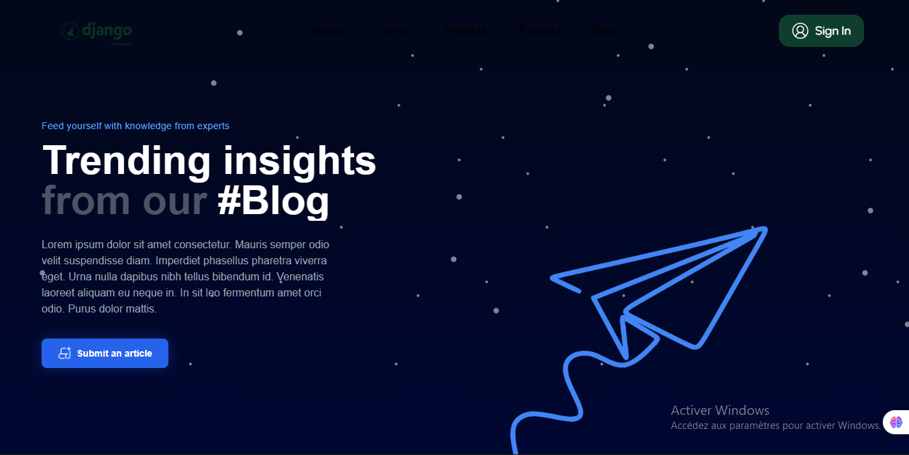
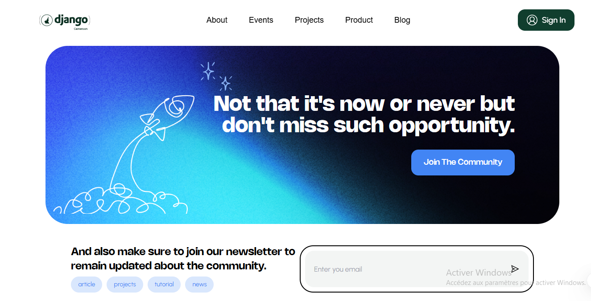

## Summary

This Pull Request introduces the new Blog page for the Django Cameroon platform. The interface has been designed to offer a smooth, modern, and fully responsive reading experience.

Closes #23

## Changes

- **Dynamic Hero Section:** An immersive header with a starry background, a deep linear gradient, and an integrated "paper airplane" illustration overlay.
- **Responsive Article Grid:**
    - Displays articles in two columns on desktop for improved readability of long titles.
    - Automatically switches to a single column on mobile.
    - Detailed article cards include tags, statistics (likes, views, reading time), and the author.
- **CTA & Newsletter section:** Integration of a "Join the community" banner with a consistent spatial design and a newsletter signup form in the footer.

## Screenshots

- Header interface

- Post Card interface

- Join community

